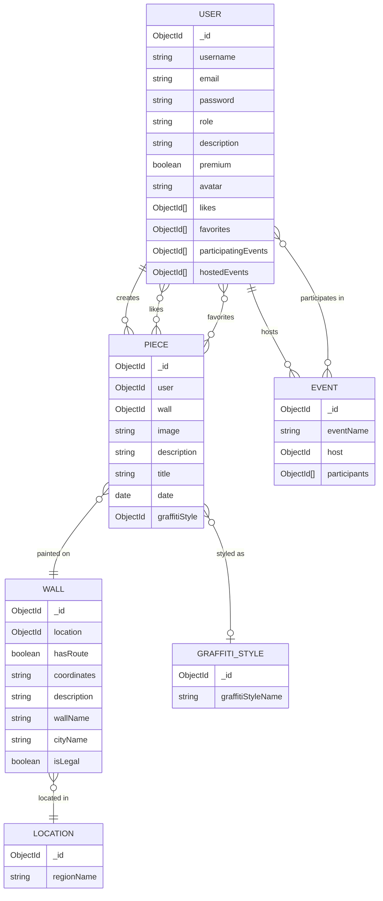

# ArtyTag

## About this project
ArtyTag is a mobile application that saves artworks from the legal walls in south-Holland in order to preserve them
in case someone paints over it.

This project was created for the fourth semester of Tailored Learning Environment Rotterdam University of Applied Sciences year 2.
The goal for this project was to create an innovative application.

The following sections will be divided into front end and back end sections, as this project is in a monorepo, we made this decision
to easily test for front end and to make sure the front end had immediate data to work with so there was no delay in development.

# ArtyTag Frontend

## About

The frontend for ArtyTag is a mobile application built with React Native and Expo. It allows users to explore legal
graffiti walls in South-Holland, view artworks, and upload their own pieces to the digital museum.

## Getting Started
Below are instructions on how to get the frontend running on your local device.

### Requirements
- Node.js 22 or 24
- NPM
- Expo Go app installed on your phone (available on the App Store and Google Play)

### Installation

1. Clone the repository
   git clone https://github.com/Tooya-Igarashi/TLE4-Digitaal-Museum.git

2. Navigate to the frontend directory and install dependencies
   cd packages/frontend2

npm install

3. Copy the .env.example file and fill in the values
   EXPO_PUBLIC_API_URL=http://145.24.237.81:8000

EXPO_PUBLIC_API_KEY=your_api_key

4. Start the frontend
   npx expo start

5. Scan the QR code with the Expo Go app on your phone

## Functionality
The frontend provides the following features:

- View all legal graffiti walls on an interactive map
- View artworks per wall in the digital museum
- Upload your own artwork to a wall
- Filter artworks by graffiti style, year and month
- Register and log in as an artist
- Add artworks to your favorites

## Technologies
- React Native
- Expo
- React Navigation
- AsyncStorage
- Expo Image Picker
- React Native Maps

## Project Structure
frontend2/

│── components/ # Reusable UI components

│── screens/ # Application screens

│── api.js # API communication

│── App.js # Root component and navigation

│── index.js # Entry point

## Backend
The backend runs separately. See the backend README for setup instructions at packages/backend.

## Backend
### Functionality
The back end for Digitaal-Museum provides the following:
- user authentication
- API key management

### Getting started
Below are instructions on how to get this project running on your local machine.
#### Requirements
This projects makes use of the following:
- Node.js & NPM
- MongoDB
#### Installation
1. Clone the repository
```sh
git clone https://github.com/Tooya-Igarashi/TLE4-Digitaal-Museum.git
```
2. Navigate to the backend map and install the dependencies
```sh
cd packages/backend
npm install
```
3. Copy the .env.example file to make the env file
4. Start the backend
```sh
npm run dev
```
your project now runs on http://localhost:8000

### What are the endpoints?
There is another readme file in the backend map that has all the available endpoints.
Get there via packages/backend

### Technologies
The back end uses the following technologies:
- [![JavaScript][JavaScript.com]][JavaScript-url]
- [![Express][Express.com]][Express-url]
- [![MongoDB][MongoDB.com]][MongoDB-url]

### Entity Relationship Diagram


